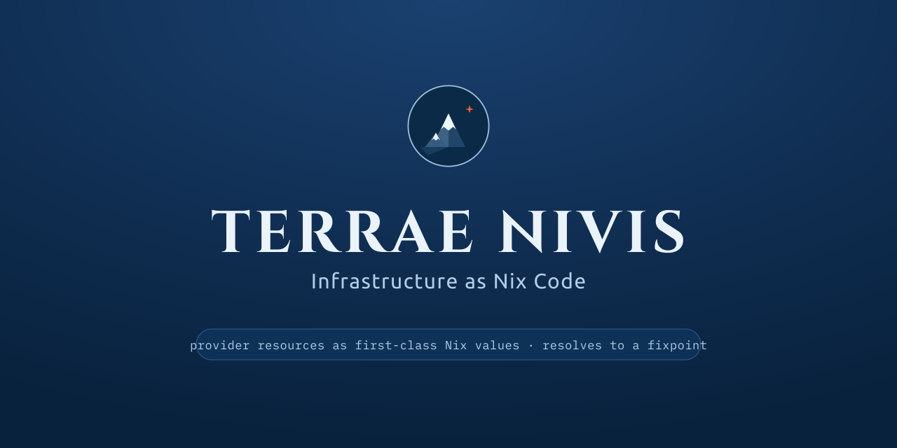

<p align="center">
  
</p>

# Nivis

Nivis lets you manage real infrastructure from Nix: Terraform/OpenTofu **provider
resources are first-class Nix values**. You write your infra in a flake; a thin
Go executor speaks the provider plugin protocol directly to **unmodified provider
binaries** and applies it. No HCL, no separate state language, Nix is the
configuration, the provider does the work.

The capability that sets Nivis apart is the **round trip**: a provider-created
resource returns computed values (an IP, an ID, a generated name) back **into
Nix**, which re-evaluates to produce dependent configuration, repeating to a
fixpoint. So a value generated by your cloud can become the input to the next
resource, or the body of a file, computed in Nix. (See it end to end in the
[AWS tutorial](docs/TUTORIAL-AWS-S3.md).)

> **Status:** early but real. The round trip works across two
> providers, and real providers (AWS today) apply/update/replace/destroy. Expect
> rough edges; the contracts (the IR, the flake interface) are the stable parts.

## Quickstart

You need **Nix** (with flakes). Run Nivis straight from the flake, no checkout:

```sh
nix run github:wearetechnative/nivis#nivis -- --version
```

Then point it at a flake that describes your infra. A minimal one:

```nix
{
  inputs.nivis.url = "github:wearetechnative/nivis";

  outputs = { self, nivis }:
    let lib = nivis.lib; in {
      # `nivis` evaluates this attribute by default.
      nivis.plan = ledger: lib.toIR {
        providers.aws = lib.mkProvider {
          source = "registry.opentofu.org/hashicorp/aws";
          config.region = "eu-central-1";
        };
        resources = [
          (lib.mkResource {
            provider = "aws"; type = "aws_s3_bucket"; name = "demo";
            config.force_destroy = true;
          })
        ];
        inherit ledger;
      };
    };
}
```

From that directory:

```sh
nivis plan      # show what will change   (+ create  ~ update  -/+ replace  = no change)
nivis apply     # apply, resolving across phases to a fixpoint
nivis state show <resource-id>
nivis destroy
```

(`nivis` shells out to `nix` to evaluate your config, and fetches + checksum-
verifies real providers from the OpenTofu registry on first use.)

- **New here?** The **[getting-started guide](docs/GETTING-STARTED.md)** walks the
  offline demo (in-repo fake providers, no cloud) and schema codegen (`nivis gen`).
- **Real infra?** The **[AWS S3 tutorial](docs/TUTORIAL-AWS-S3.md)** builds a
  bucket and a file whose contents Nix generates from the bucket's name (the
  round trip), from an empty directory.
- **Installing `nivis`** (`nix shell`, `nix profile`): see
  **[docs/INSTALL.md](docs/INSTALL.md)**.
- **How does it compare?** An honest **[comparison](docs/COMPARISON.md)** with
  Terranix, OpenTofu/Terraform, Pulumi, NixOps, CDK and CloudFormation, including
  where Nivis is still young.
- Browse it all on the **[docs site](https://wearetechnative.github.io/nivis/)**.

## How it works (one paragraph)

Nix evaluates your configuration to a JSON **IR**. Values that aren't known until
apply-time are emitted as typed placeholders, a `__ref` (another resource's
output) or a `__derived` (a value Nix *computed* from an output). The executor
ingests the IR, drives the providers, gathers their apply-time outputs into a
**ledger**, then **re-evaluates Nix** with that ledger injected so placeholders
resolve; deeper chains take more phases, to a fixpoint. The full reasoning and
why this (not an `Output<T>` promise model) is the honest, Nix-shaped approach
is in **[docs/OVERVIEW.md](docs/OVERVIEW.md)** and
**[docs/DESIGN.md](docs/DESIGN.md)**.

## The Nix library

`nivis.lib` is pure (builtins only, no nixpkgs, so it evaluates without the
binary cache):

- `mkResource { provider; type; name; config; }`: a resource, with output
  references (`refAttr`) for wiring one resource into another.
- `mkData { provider; type; name; config; }`: a datasource (existing infra to
  read, not create); its outputs feed resources via `refAttr`, read per phase.
  See **[docs/DATASOURCES.md](docs/DATASOURCES.md)**.
- `mkProvider { source; config; }`: a provider, config (incl. nested blocks) in
  Nix; flows into the provider's `Configure`.
- `str`/`derived`: build values from provider outputs (the round trip).
- `mkVars`: declare typed config variables with defaults (required when no
  default), resolved from `--var` / `--var-file` / `NIVIS_VAR_*` (an explicit
  `--var` wins). Read them as `vars.<name>` in the plan.
- `drv`/`drvFile`: mark a Nix build output (a derivation) so `nivis apply`
  realises it before use; `drv d` uses `d.passthru.filePath` when present,
  `drvFile d "sub/path"` names a file explicitly. (See the EC2 tutorial.)
- `toIR`: serialize to the IR; `mkResources` (`count`/`for_each`) and
  `evalModules` (module composition).

`nivis gen --provider <binary> --out <dir>` generates typed constructors from any
provider's schema.

## Stable contracts

Versioned interfaces, change the spec before the shape:

- **The IR**: `docs/IR-CONTRACT.md` + `docs/ir-schema.json` (the normative JSON
  Schema). Both the Nix `toIR` producer and the Go consumer validate against it.
- **The flake interface**: `nivis.plan = ledger → IR`, evaluated each phase with
  the outputs ledger injected.

## Contributing / building from source

Nivis is built with the standard Go toolchain; the flake (`nix build .#nivis`,
`nix run .#nivis`) is the packaged path. From a checkout:

```sh
go build -o bin/nivis ./cmd/nivis     # the CLI
go test ./...                         # Go unit + e2e (uses the in-repo fakes)
bash tests/run-nix-tests.sh           # Nix property tests + IR conformance
bash tests/check-docs-ssot.sh         # docs single-source-of-truth
```

The repo follows a spec-driven process guided by `openspec/` (the per-change
specs). Releases: `docs/RELEASING.md`.

## License

Nivis's own code is **Apache-2.0** (`LICENSE`). See `LICENSING.md` for the
breakdown and `NOTICE` for attributions.
